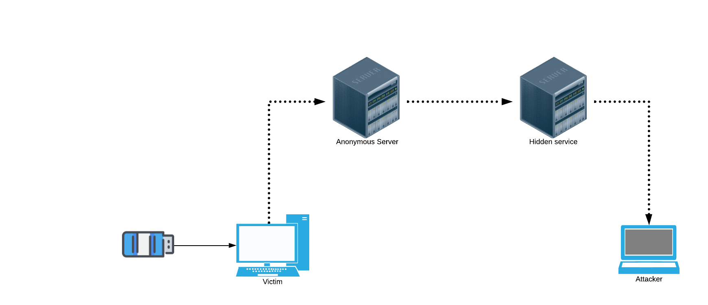

# **RAT_project**

USBbola injection permettant de scanner la machine victime, puis envoie les infos sensibles tel que l'ip publique, la mac,un nmap du reseau... et toutes commandes possibles sur Linux ou Powershell par le biais d'un traffic DNS qui sera exfiltré par un Hidden Service Tor (Anonyme - server Web nginx) et recupéré sur le server Web.

**Eventualités d'evolution :**

- Reverse Shell (Netcat, Telnet, Ssh, Dns exfiltration...)
- "MITM : Man In The Middle" (DNS Spoofing...)
- .. Libre court aux possibilités des cmd ..

**NB : le fichier [sketch_feb22a.txt](https://github.com/lucasreq/RAT_project/blob/master/sketch_feb22a.txt) est un fichier Arduino, ne pas oublier l'extension .ino**

# **Etapes projet:**

## 1. **USBbola injection** 
  - PowerShell as Admin >>> [sketch_feb22a.txt](https://github.com/lucasreq/RAT_project/blob/master/sketch_feb22a.txt)
  - Open a Storage Path and launch the script
  - Disable FireWall for all Users
  - (Open a Backdoor from port 51486)
  - Recuperate return of any cmd (Here is for ipconfig)
  - Exfiltrate infos into DNS request to our server
## 2. **Footprinting python**
  - Searched informations :
      - IP
      - OS
      - distrib
      - mac
      - user
  - Recursiv files scan
  - Environnement scan
  - Data exfiltration with Scapy (target)
    - Utilisation de paquets DNS qui vont servir de "boites" pour encapsuler les données scannées et passer inaperçu au yeux d'une personne non aguerrie. >>> [crafting.py](https://github.com/lucasreq/RAT_project/blob/master/crafting.py)
    
## 3. **Hidden service Tor (nginx):**
 
  - Request DNS sniffing (server) : Récupère la donnée de la machine victime, la décapsule, puis la filtre pour pouvoir etre lu sur son Server Web >>> [sniifer.py](https://github.com/lucasreq/RAT_project/blob/master/sniifer.py)
  
## 4. **Etapes de déroulement**
  - Etape 1 : Connecter la badUSB
  - Etape 2 : Injection du script >> [sketch_feb22a.txt](https://github.com/lucasreq/RAT_project/blob/master/sketch_feb22a.txt)
  - Etape 3 : Lancement du script et récupération des données du système >> [crafting.py](https://github.com/lucasreq/RAT_project/blob/master/crafting.py)
  - Etape 4 : Envois des données via des requetes DNS = exfiltration
  - Etape 5 : Reception des paquets sur le serveur >> [sniifer.py](https://github.com/lucasreq/RAT_project/blob/master/sniifer.py)
  - Etape 6 : Traitement des requetes DNS, filtrage et écriture des données 
  - Etape 7 : Visualisation des données sur le serveur web du hidden service